# Laporan Resmi Praktikum Komunikasi Data dan Jaringan Komputer 

## Modul 1 Kelompok IT-32

**Anggota:**

Atha Rahma Arianti - 5027221030

Nur Azka Rahadiansyah - 5027221064

# **FUZZ:**

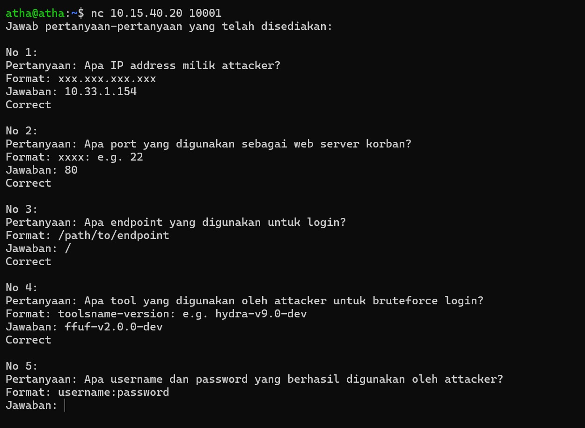

filter http, cari info POST

dapet info dapet info IP address 

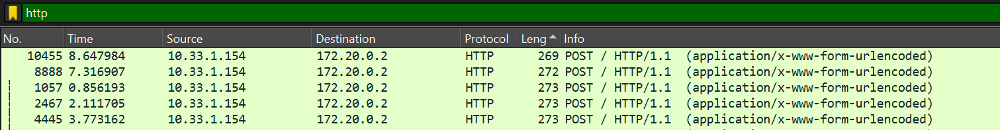

filter tcp
dapet info port 80 

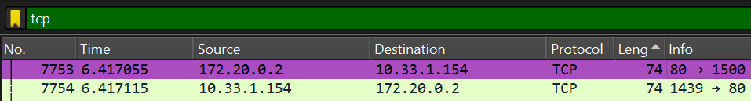

balik ke filter http, klik paling bawah yg 302 found, FOLLOW 

dapet info endpoint / 

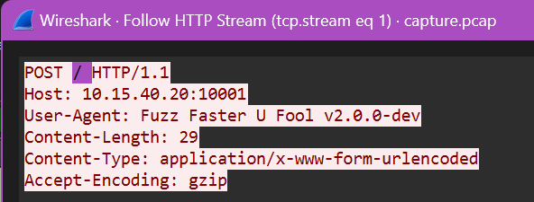

dapet info toolname Fuzz Faster U Fool v2.0.0-dev, disingkat 

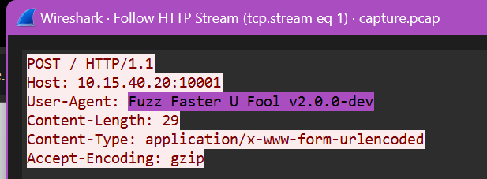

cari 302 found di bawah 

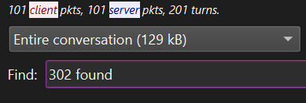

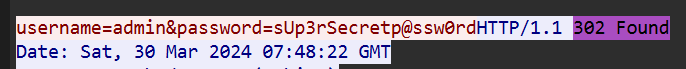

dapet user & password, sayangnya baru dapet pas waktunya dah abis :((((

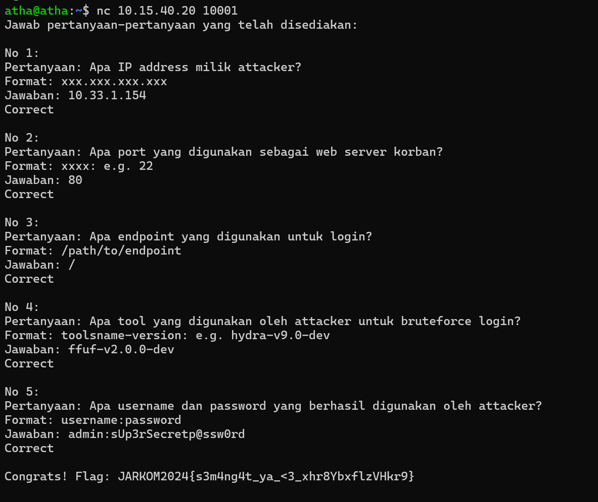

# **EVIDENCE:** 

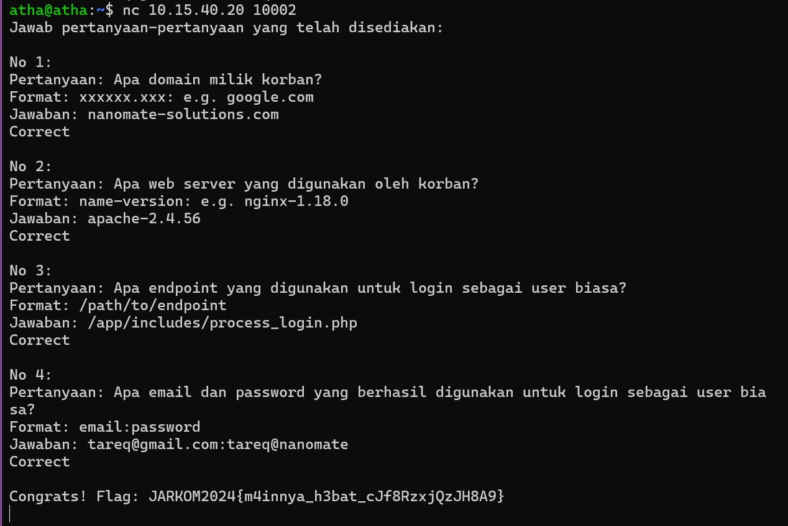

filter http

cari info POST

follow 

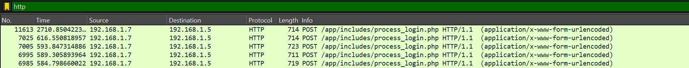

dapet info host nanomate-solutions.com 

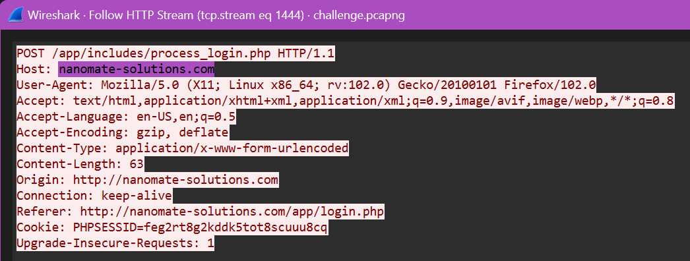

dapet info server Apache/2.4.56 

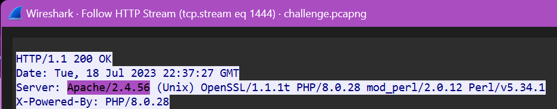

dapet info endpoint /app/includes/process_login.php 

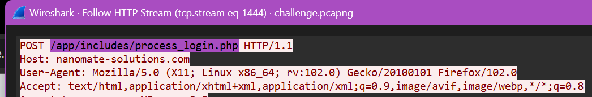

filter tcp.stream eq 1248 (asalnya cari dari frame.len == 714 soalnya percobaan login ada di situ semua, dah dibuka 1” invalid semua kecuali yg eq 1248 ini) 

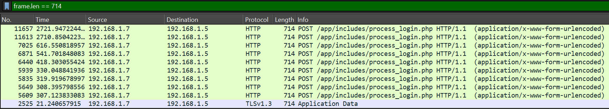

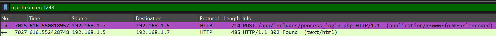

follow, dapet info email tareq@gmail.com dan password tareq@nanomate 

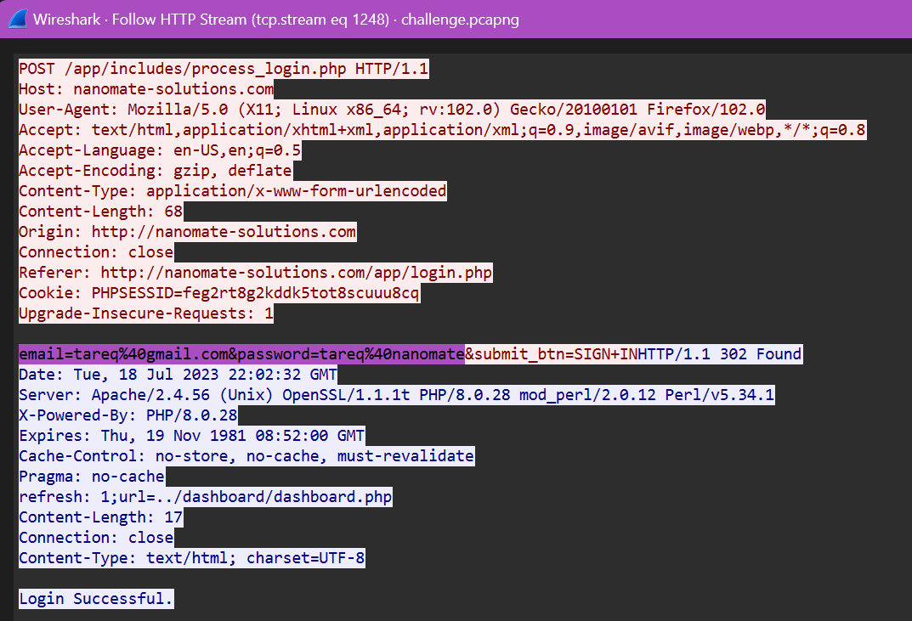

# **ATM ATP OR FTP**

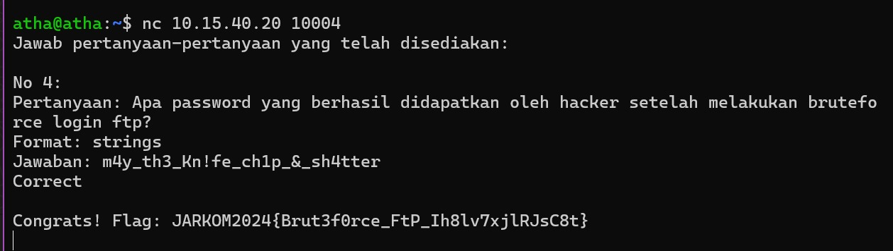

filter “ftp”

cari login successfull (code=230) 

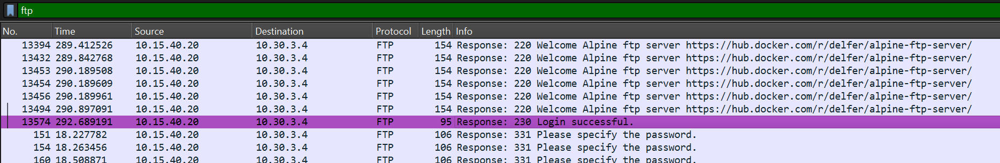

follow

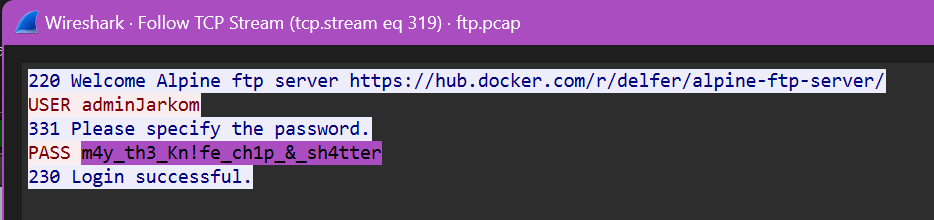

dapet password 

# **HOW MANY PACKAGES**
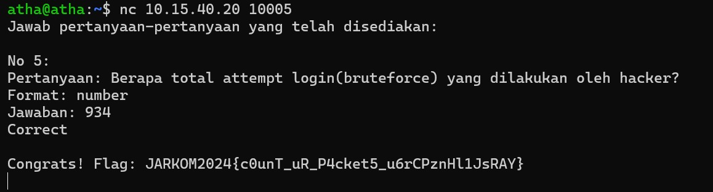

di bagian statistic, packet length, filter frame.len == 94 (soalnya percobaan login yg gagal ada di length 94)

dapet angka 934 

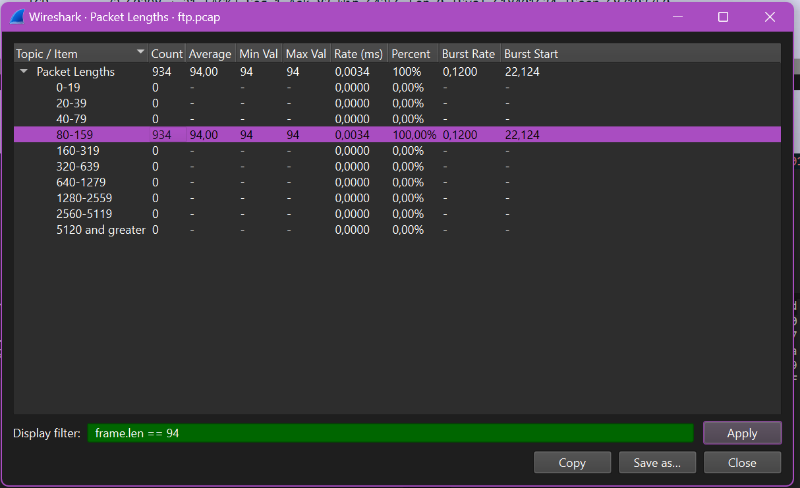

# **TRACE HIM**
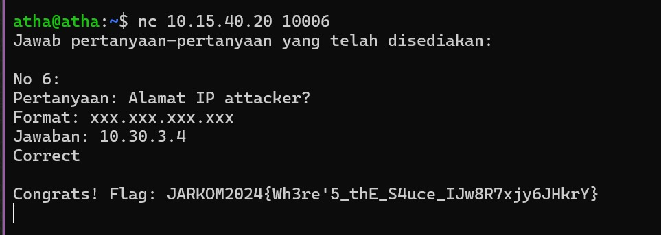

filter ftp

cari yg infonya request, berarti asalnya dari situ, IP nya 10.30.3.4 
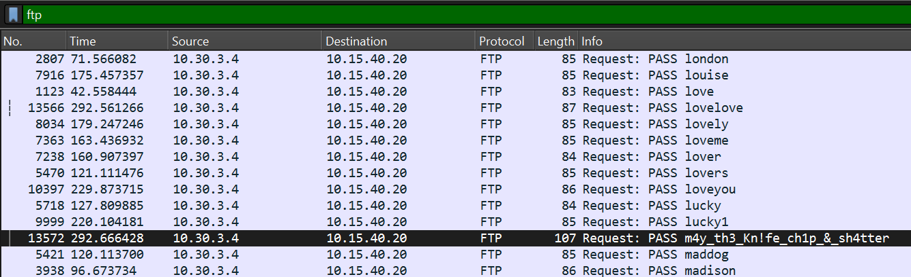

# **creds**
(File Name : evidence)
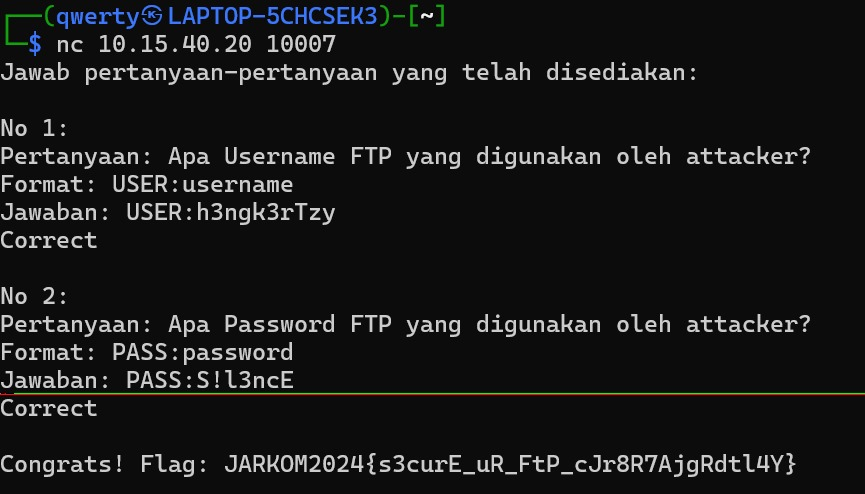

filter “FTP” 
pada bagian info terdapat user dan password yang dikirim oleh 10.30.3.1
atau juga bisa menggunakan Analyze -> follow -> tcp stream

# **malwleowleo**
(File Name : evidence)
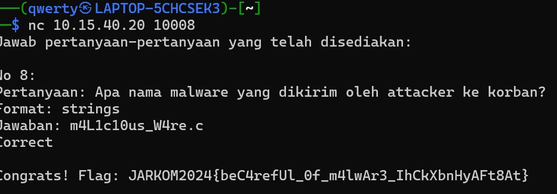

filter “FTP” 

menggunakan Analyze -> follow -> tcp stream

atau juga bisa mencari lewat filter tcp.stream eq 14 lalu menggunakan langkah yang sama dengan langkah 2

# **Sekian Laporan Resmi Praktikum Komunikasi Data dan Jaringan Komputer dari Kelompok IT-32**
## MATUR TENGKYU <3
